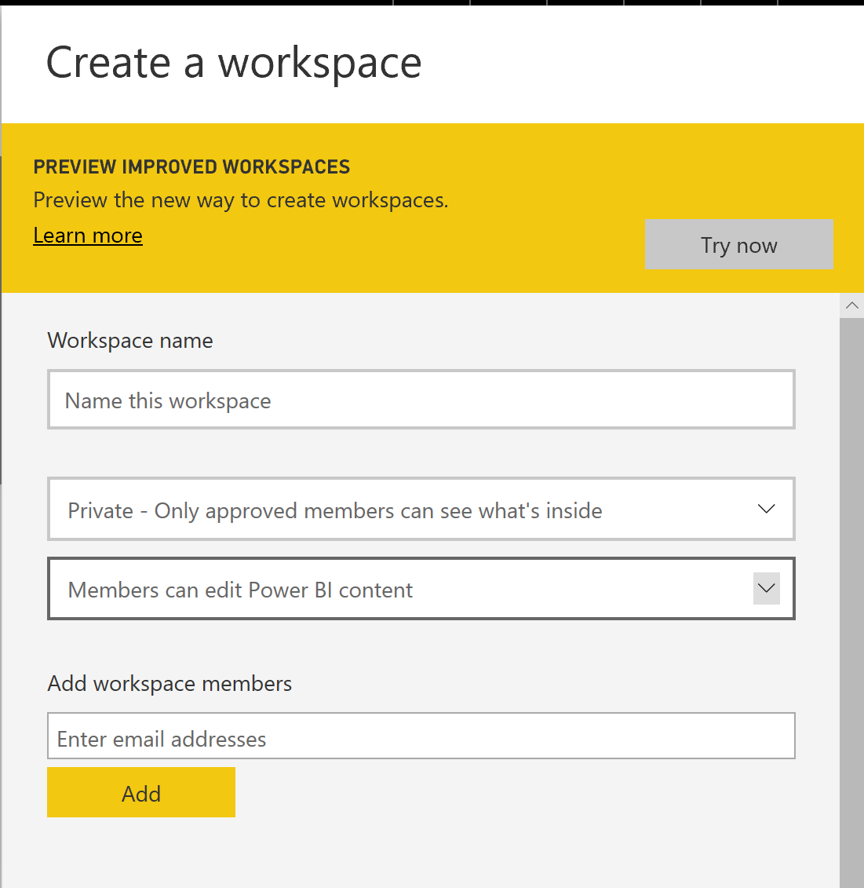

# Integrate Azure SQL row level security with PowerBI Embedded in .Net Core

## About this sample

### Overview

This sample shows how to build an end-to-end demonstration of Azure SQL Database row level security using PowerBI Embedded and .Net Core.  Once the steps are complete, you will be able to demonstrate an access control pattern that only allows a PowerBI report to display data that the signed-in user is permitted to see.


### Scenario

Run the application, and sign in with Azure AD credentials to view the report. Click the "Switch User" link in the top navigation bar to sign in as a different user.  Compare the results seen by different user accounts to see that the report is filtered based on the identity of the signed-in user.

## How To Run This Sample

To run this sample, you'll need:

- [Visual Studio 2017](https://aka.ms/vsdownload)
- An Internet connection
- An Azure subscription
- At least two user accounts in your Azure AD tenant for testing the functionality

### Step 1:  Clone or download this repository

From your shell or command line:

`git clone https://github.com/{tbd}.git`
> Given that the name of the sample is pretty long, and so are the name of the referenced NuGet pacakges, you might want to clone it in a folder close to the root of your hard drive, to avoid file size limitations on Windows.

### Step 2:  Create and configure SQL database

In order to apply role based security in Azure SQL Database you first must have a database to work with.  These steps will walk you through creating a basic example of an Azure SQL database with Azure Active Directory authentication and role based security.

1. Create an Azure SQL Database.  If you need instructions you can find a step by step guide here:  https://docs.microsoft.com/en-us/azure/sql-database/sql-database-get-started-portal#create-a-sql-database
2. Set an Azure Active Directory Admin for the SQL Database you just created, this is required to grant AAD users access to your database.  For instructions you can find a guide here:  https://docs.microsoft.com/en-us/azure/sql-database/sql-database-aad-authentication-configure#provision-an-azure-active-directory-administrator-for-your-azure-sql-database-server
3. Connect to the database with your management tool of choice (ie. Query editor or Management Studio), and be sure to login with the SQL AAD Admin.
4. Now we need to populate some objects in the database and apply security settings.  Replace the <aaduser1> and <aaduser2> values in the following script with your actual AAD users, and run the script in your query tool:

```
--create the table
CREATE TABLE Sales  
    (  
    OrderID int,  
    SalesRep sysname,  
    Product varchar(10),  
    Qty int  
    );

--add some data
INSERT Sales VALUES   
(1, '<aadaccount1>', 'Valve', 5),   
(2, '<aadaccount1>', 'Wheel', 2),   
(3, '<aadaccount1>', 'Valve', 4),  
(4, '<aadaccount2>', 'Bracket', 2),   
(5, '<aadaccount2>', 'Wheel', 5),   
(6, '<aadaccount2>', 'Seat', 5);  


CREATE SCHEMA Security;  
GO  

--security function returns a bit if the user has the dbo role or the username matches the SalesRep column
CREATE FUNCTION Security.fn_securitypredicate(@SalesRep AS sysname)  
    RETURNS TABLE  
WITH SCHEMABINDING  
AS  
    RETURN SELECT 1 AS fn_securitypredicate_result   
WHERE @SalesRep = USER_NAME() OR USER_NAME() = 'dbo'; 

--security policy
CREATE SECURITY POLICY SalesFilter  
ADD FILTER PREDICATE Security.fn_securitypredicate(SalesRep)   
ON dbo.Sales  
WITH (STATE = ON);
```  

You now have a database with a role based security policy, and need to assign your AAD users access to that database.  To assign a user to the database run the following command for each user:

```
--note, must do this as the aad admin
CREATE USER [<aadusername>] FROM EXTERNAL PROVIDER
```

In order to test that the security is configured correctly you can run the following command:

```
--test...
EXECUTE AS USER = '<aaduser1>';  
SELECT * FROM Sales;   
REVERT; 
```

### Step 3:  Create PowerBI Workspace and report

**Create the Power BI Workspace and Capacity**

1. Login to the [Azure portal](https://portal.azure.com) and create a new Power BI Embedded capacity.  [Detailed instructions](https://docs.microsoft.com/en-us/power-bi/developer/azure-pbie-create-capacity#create-a-capacity) _(Note:  Make sure you create this capacity in the same region as the database you created in Step 2, and make sure the user you set as your capacity administrator is the same user you use to login to Power BI.)_
2. Login to [Power BI](https://app.powerbi.com) as a Power BI Pro user so we can create a workspace to publish our reports.  _(Note: if you don't presently have a pro license you can sign up for a 60 day pro trial)_
3. Once you've logged into Power BI, create a new app workspace, give the workspace a name and invite any other users that may need to publish reports.

4. Under the advanced section, select the Power BI Embedded capacity you provisioned, and click save.


**Create and Publish the Power BI Model**

1. Open Power BI Desktop
2. Get data make sure you use "Direct Connect" and not cached mode.
3. Create a report that includes data from the table "Sales" which uses role based security.
4. Publish the report to Power BI in the workspace you just created.
5. Back in Power BI.com, edit the settings for the published dataset.

6. Navigate to "Data source credentials" and click "Edit Credentials"
7. Configure the connection to the database using a user with administrative rights (the AAD admin or the SQL admin), and be sure to check the box allowing AAD user credentials to be used for DirectQuery.
 

### Step 4:  Create Azure AD app registrations

Lorem ipsum dolor sit amet, consectetur adipiscing elit, sed do eiusmod tempor incididunt ut labore et dolore magna aliqua. Ut enim ad minim veniam, quis nostrud exercitation ullamco laboris nisi ut aliquip ex ea commodo consequat. Duis aute irure dolor in reprehenderit in voluptate velit esse cillum dolore eu fugiat nulla pariatur. Excepteur sint occaecat cupidatat non proident, sunt in culpa qui officia deserunt mollit anim id est laborum.

### Step 5:  Configure .Net Core web application

Add the required values to appsettings.json

Lorem ipsum dolor sit amet, consectetur adipiscing elit, sed do eiusmod tempor incididunt ut labore et dolore magna aliqua. Ut enim ad minim veniam, quis nostrud exercitation ullamco laboris nisi ut aliquip ex ea commodo consequat. Duis aute irure dolor in reprehenderit in voluptate velit esse cillum dolore eu fugiat nulla pariatur. Excepteur sint occaecat cupidatat non proident, sunt in culpa qui officia deserunt mollit anim id est laborum.

### Step 6:  Build and run the sample

Clean the solution, rebuild the solution, and run it.

On the Azure AD sign-in page, enter the name and password of one of the user accounts you configured in the SQL database in Step 2 above.

### Step 7 (Optional):  Deploy the sample application to Azure

Lorem ipsum dolor sit amet, consectetur adipiscing elit, sed do eiusmod tempor incididunt ut labore et dolore magna aliqua. Ut enim ad minim veniam, quis nostrud exercitation ullamco laboris nisi ut aliquip ex ea commodo consequat. Duis aute irure dolor in reprehenderit in voluptate velit esse cillum dolore eu fugiat nulla pariatur. Excepteur sint occaecat cupidatat non proident, sunt in culpa qui officia deserunt mollit anim id est laborum.


