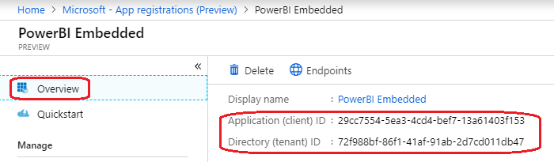
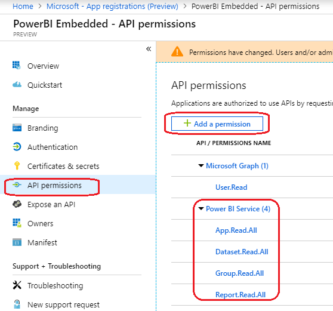
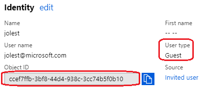

# Integrate Azure SQL row level security with Power BI Embedded in .Net Core

## About this sample

### Overview

This sample shows how to build an end-to-end demonstration of Azure SQL Database row level security using Power BI Embedded and .Net Core.  Once the steps are complete, you will be able to demonstrate an access control pattern that only allows a Power BI report to display data that the signed-in user is permitted to see.  For more information on this feature, see [Token-based Identity with Azure SQL Database (Preview)](https://docs.microsoft.com/en-us/power-bi/developer/embedded-row-level-security#token-based-identity-with-azure-sql-database-preview)


### Scenario

Run the application, and sign in with Azure AD credentials to view the report. Click the "Switch User" link in the top navigation bar to sign in as a different user.  Compare the results seen by different user accounts to see that the report is filtered based on the identity of the signed-in user.

## How To Run This Sample

To run this sample, you'll need:

- [Visual Studio 2017](https://aka.ms/vsdownload)
- An Internet connection
- An [Azure subscription](https://azure.microsoft.com/en-us/free/)
- A Power BI Pro or [trial](https://powerbi.microsoft.com/en-us/get-started/) license
- At least two user accounts in your Azure AD tenant for testing the functionality

### Step 1:  Clone or download this repository

From your shell or command line:

`git clone https://github.com/chmitch/powerbi-sql-rbs.git`

### Step 2:  Create and configure SQL database

In order to apply role based security in Azure SQL Database you first must have a database to work with.  These steps will walk you through creating a basic example of an Azure SQL database with Azure Active Directory authentication and role based security.

1. Create an Azure SQL Database.  If you need instructions you can follow the step by step guide to [create a SQL database](https://docs.microsoft.com/en-us/azure/sql-database/sql-database-get-started-portal#create-a-sql-database).
2. Set an Azure Active Directory Admin for the SQL Database you just created. This is required to grant AAD users access to your database.  For detailed instructions see [provisioning an Azure AD administrator for your Azure SQL Database server](https://docs.microsoft.com/en-us/azure/sql-database/sql-database-aad-authentication-configure#provision-an-azure-active-directory-administrator-for-your-azure-sql-database-server).
3. Connect to the database with your management tool of choice (ie. [Azure Query editor](https://docs.microsoft.com/en-us/azure/sql-database/sql-database-connect-query-portal) or [Management Studio](https://docs.microsoft.com/en-us/sql/ssms/scripting/query-and-text-editors-sql-server-management-studio)), and be sure to login with the SQL AAD Admin account from Step 2.<p></p>
4. Now we need to populate some objects in the database and apply security settings.  Replace the <aaduser1> and <aaduser2> values in the following script with your actual AAD users, and run the script in your query tool.  User accounts should take the form of the full User Principal Name (UPN), which is normally the user's email address (for example, "jdoe@contoso.onmicrosoft.com" or "jdoe@contoso.com").  

> *Note!* If you don't already have some test users in your AD tenant, you'll first need to [create some user accounts](https://docs.microsoft.com/en-us/azure/active-directory/fundamentals/add-users-azure-active-directory#add-a-new-user) before you can add them to your SQL database.

```
--create the table
CREATE TABLE Sales  
    (  
    OrderID int,  
    SalesRep sysname,  
    Product varchar(10),  
    Qty int  
    );

--add some data
INSERT Sales VALUES   
(1, '<aadaccount1>', 'Valve', 5),   
(2, '<aadaccount1>', 'Wheel', 2),   
(3, '<aadaccount1>', 'Valve', 4),  
(4, '<aadaccount2>', 'Bracket', 2),   
(5, '<aadaccount2>', 'Wheel', 5),   
(6, '<aadaccount2>', 'Seat', 5);  


CREATE SCHEMA Security;  
GO  

--security function returns a bit if the user has the dbo role or the username matches the SalesRep column
CREATE FUNCTION Security.fn_securitypredicate(@SalesRep AS sysname)  
    RETURNS TABLE  
WITH SCHEMABINDING  
AS  
    RETURN SELECT 1 AS fn_securitypredicate_result   
WHERE @SalesRep = USER_NAME() OR USER_NAME() = 'dbo'; 

--security policy
CREATE SECURITY POLICY SalesFilter  
ADD FILTER PREDICATE Security.fn_securitypredicate(SalesRep)   
ON dbo.Sales  
WITH (STATE = ON);
```  

You now have a database with a role based security policy, and need to assign your AAD users access to that database.  To assign a user to the database run the following command for each user.

```
--note, must do this as the aad admin
CREATE USER [<aadusername>] FROM EXTERNAL PROVIDER
```

In order to test that the security is configured correctly you can run the following command:

```
--test...
EXECUTE AS USER = '<aaduser1>';  
SELECT * FROM Sales;   
REVERT; 

--you can also verify the external users with the following query
SELECT * FROM sys.database_principals where [type] = 'E'
```
>*Note!* If you have trouble adding users to the database in the previous step, see the [troubleshooting](#troubleshooting) section.

### Step 3:  Create Power BI Workspace and report

**Create the Power BI Workspace and Capacity**

1. Use the [Azure portal](https://portal.azure.com) to create a new Power BI Embedded capacity.  [Detailed instructions](https://docs.microsoft.com/en-us/power-bi/developer/azure-pbie-create-capacity#create-a-capacity) _(Note:  Make sure you create this capacity in the same region as the database you created in Step 2, and make sure the user you set as your capacity administrator is the same user you use to login to Power BI.)_
2. Login to [Power BI](https://app.powerbi.com) as a Power BI Pro user so we can create a workspace to publish our reports.  _(Note: if you don't presently have a pro license you can sign up for a 60 day pro trial)_
3. Once you've logged into Power BI, create a new app workspace, give the workspace a name and invite any other users that may need to publish reports. <p></p>
4. Under the advanced section, select the Power BI Embedded capacity you provisioned, and click save.<p></p>

**Create and Publish the Power BI Model**

1. Open Power BI Desktop
2. Get data make sure you use "Direct Connect" and not cached mode.
3. Create a report that includes data from the table "Sales" which uses role based security.
4. Publish the report to Power BI in the workspace you just created.
5. Back in PowerBI.com, navigate to the report you just published.  From the Url in the browser address bar, note the WorkspaceId and ReportId (the GUID values following the `groups` and `reports` url segments, respectively).  You will need these values later to configure embedding in the .Net web application.<p></p>
6.  Next, edit the settings for the published dataset.<p></p>
7. Navigate to "Data source credentials" and click "Edit Credentials"
8. Configure the connection to the database using a user with administrative rights (the AAD admin or the SQL admin), and be sure to check the box allowing AAD user credentials to be used for DirectQuery.<p></p>

### Step 4:  Create Azure AD app registrations

This example requires two app registrations in your Azure AD Tenant.  
* The first will be used to connect to the Power BI Service and generate the embed token for the report.  
* The second will be used for the web application and the token exchange that will allow Power BI to access the SQL database on behalf of the end user.

You can follow the detailed instructions for [creating](https://docs.microsoft.com/en-us/azure/active-directory/develop/quickstart-register-app) and [configuring](https://docs.microsoft.com/en-us/azure/active-directory/develop/quickstart-configure-app-access-web-apis) an app registration, and include the specific configuration required for the two applications below.

**Create the app registration for report embedding**
1. Start a new app registration.<p></p>
2. Name the application, and choose "Public Client (mobile & desktop)".<p></p>
3. Make note of the Azure AD Directory Id and Application Id, since you will need them later.<p></p>
4. Add permissions for the Power BI service by clicking "Add Permission", selecting the Power BI Service, and then add the `Group.Read.All` and `Report.Read.All` delegated permissions.<p></p>
>*Note!* Be sure to always click the "Grant Permissions for {tenant name}" button at the bottom of the permissions blade any time you add permissions to an application.  If the button is disabled, you must have an Azure AD Global Admin consent to the permissions for you.

**Create the app registration to access Azure SQL on behalf of the end user**
1.  Create an new app registration, and enter `https://localhost:44302/signin-oidc` as the Redirect Uri.  As before, make note of the Application Id, since you will need it later.<p></p>
2.  Just like the previous app registration, you'll need to add permissions.  Add a new API permission for SQL Azure Database, and select the `user_impersonation` delegated permission.<p></p>
>*Note!* If you don't see SQL Azure Database in the list of APIs, try searching for it on the "APIs my organization uses" tab.  If you still don't see it, refer to the [troubleshooting](#Troubleshooting) section below.
3.  Add a client secret.  Make sure to make a copy of the secret value before exiting the blade, since you will need it later.<p></p>

### Step 5:  Configure .Net Core web application

1. Open the PowerBI-AzureSQL-AzureAD-DotNetCore solution from the local folder you cloned in [Step 1](#step-1--clone-or-download-this-repository) above.
2. In the PowerBI-AzureSQL-AzureAD-DotNetCore project, open the `appsettings.json` file and add the configuration values captured from the previous steps in this tutorial:
    -  `AADTenantId` should be the GUID value of your Azure AD directory
    -  `ClientId` should be the GUID Application Id of the web application (the second app registration you created)
    -  `ClientSecret` should be the value of the secret you created for the web application
    -  `PbiApplicationId` should be the GUID Application Id of the Power BI application (the first app registration you created)
    -  `WorkspaceId` and `ReportId` should be the GUID values you captured after you published the Power BI report.
    -  `PbiUsername` and `PbiPassword` should be the credentials of your Power BI pro user account.
3.  Save `appsettings.json`

### Step 6:  Build and run the sample

Clean the PowerBI-AzureSQL-AzureAD-DotNetCore solution, rebuild the solution, and run it.

On the Azure AD sign-in page, enter the name and password of one of the user accounts you configured in the SQL database in [Step 2](#step-2--create-and-configure-sql-database) above.

### Step 7: (Optional) Deploy the sample application to Azure

To deploy this sample as an App Service in Azure, right click on the project in Visual Studio and choose `Publish`.  Choose "App Service" as the publish target, and follow the prompts in the wizard to complete the deployment.  A [step-by-step](https://docs.microsoft.com/en-us/azure/app-service/app-service-web-get-started-dotnet#launch-the-publish-wizard) guide is available to follow.

>*Note!* Once you've deployed the application, the Redirect Uri you configured for the web application (the second app registration) in [Step 4](#step-4--create-azure-ad-app-registrations) above, and add a new Redirect Uri to the app registration.  For example, if you deployed the application to "myapp.azurewebsites.net", add a Redirect Uri for `https://myapp.azurewebsites.net/signin-oidc`.<p></p>

## Troubleshooting

**Can't add an Azure AD user to the SQL database**

If the external user you entered fails to resolve as an AD user, or you receive and error such as `Error: Principal 'someuser' could not be found or this principal type is not supported.` you may not have the correct UPN.  Open the user's Profile in your Azure Active Directory tenant, and verify the information:
    - Make sure you are using the "User name" value for internal users, or
    - You can substitute the user's Object Id for the Username in the `CREATE USER` SQL command.  This works especially well for Guest Accounts, such as invited B2B users, because the full UPN contains additional characters to identify the user's home tenant which are not visible on the user's profile page.<p></p>

**"Cannot Load Model" error when viewing the report in the web application**

If you receive the error below when viewing the report in the web application, but you can view the report normally on powerbi.com, there may be an issue with the Power BI premium capacity in your Azure subscription.  The most like cause is that the capacity is not currently running.  Visit the Azure portal to verify that it is configured properly. <p></p>

## Considerations for using this sample

## Additional resources


